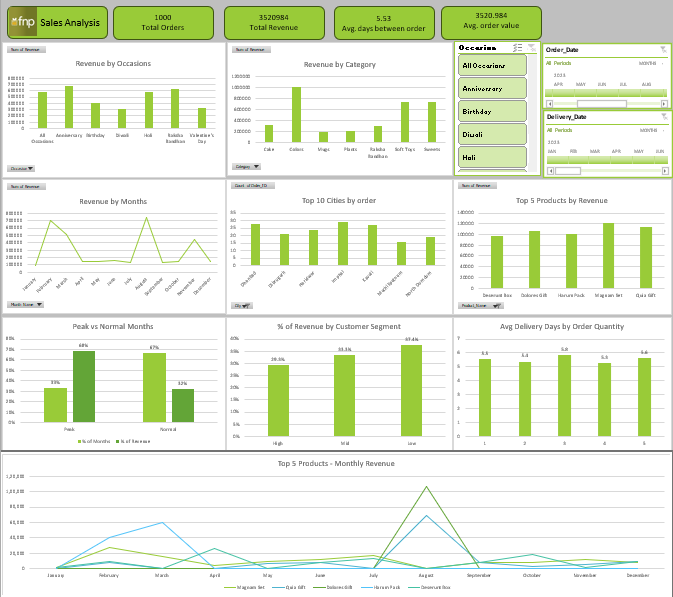

# FNP Sales Data Analysis | MS Excel

Sales analysis of a Ferns and Petals (FNP) gifting dataset, built entirely in Microsoft Excel using Power Query, Power Pivot, Pivot Tables, Slicers, Timelines and formulas.

## Dataset
Three tables: **orders**, **products** and **customers** (FNP sample dataset, 2023).

## Files
| File | Description |
|---|---|
| `Excel_sales_analysis_project_final.xlsx` | Excel workbook with Power Query, Data Model, pivot tables, dashboard and analysis sheets |
| `orders.csv` | Order details: product, quantity, order and delivery dates, location, occasion |
| `products.csv` | Product name, category, price and occasion |
| `customers.csv` | Customer details: name, city, gender |
| `Ferns_and_Petals_Sales_Analysis.pdf` | Problem statement with the 10 business questions |
| `dashboard.png` | Screenshot of the dashboard |

## What I did
**1. Data preparation (Power Query + Power Pivot)**
- Loaded orders, products and customers through Power Query into the Data Model.
- Created new columns: Revenue, delivery days (order to delivery), Month Name, Day Name and Hour.

**2. Interactive dashboard (Pivot Tables + Pivot Charts)**
- KPI cards: Total Orders, Total Revenue, Avg days between order and delivery, Avg order value.
- Pivot charts: Revenue by Occasion, Revenue by Category, Revenue by Month, Top 10 Cities by Orders, Top 5 Products by Revenue.
- Occasion slicer and Order Date / Delivery Date timelines for filtering.
- Additional charts: Peak vs Normal Months, % of Revenue by Customer Segment, Avg Delivery Days by Order Quantity, Top 5 Products - Monthly Revenue.

**3. Further analysis (Excel formulas)**
- **Peak Months:** monthly orders, revenue and delivery days using COUNTIFS, SUMIFS and AVERAGEIFS. Months with above-average orders are flagged as Peak.
- **Customer Segments:** customers ranked by total spend (SUMIF, RANK) and grouped into High (top 20), Mid (next 30) and Low (remaining 50).
- **What If:** effect on total revenue of increasing average order value in normal months.
- **Products and Delivery:** monthly revenue of the top 5 products (SUMIFS) and average delivery days by order quantity (COUNTIFS, AVERAGEIFS, CORREL). Quia Gift has two Product IDs (21 and 56), so both are added together.

## Key Insights
- Total revenue of ₹35.2L, with an average delivery time of 5.5 days.
- 4 festival months (Feb, Mar, Aug, Nov), just 33% of the year, brought in 68% of revenue: Valentine's Day, Holi, Raksha Bandhan and Diwali.
- Peak months get about 4x more orders per month than normal months, while delivery time stays almost the same (5.6 vs 5.4 days).
- The top 20% of customers bring in 29% of revenue, so revenue is spread across many customers. High-value customers order more often rather than spending more per order.
- A 10% higher order value in normal months would add about 3.2% to total revenue.
- Dolores Gift sells only in August (Raksha Bandhan) and Harum Pack only in festival months, while Magnam Set and Deserunt Box sell throughout the year.
- Order quantity has no relationship with delivery time: 5.3 to 5.8 days for every quantity (CORREL ≈ 0).

## Recommendations
- Stock up and arrange extra delivery capacity 3–4 weeks before each festival.
- Use repeat-order / loyalty offers to increase how often customers order.

## Tools
Microsoft Excel: Power Query, Power Pivot (Data Model), Pivot Tables, Pivot Charts, Slicers, Timelines, COUNTIFS, SUMIFS, AVERAGEIFS, SUMIF, RANK, CORREL.
